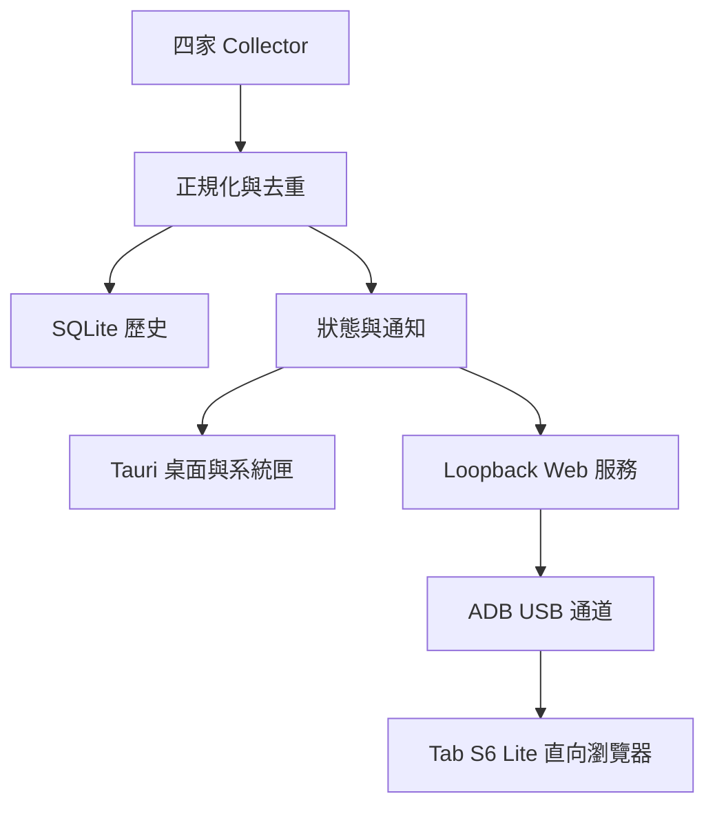

# AgentMeter｜AI Agent 用量監控中心

完整開發需求規格書 v1.0  
日期：2026-09-06  
文件用途：作為產品設計、技術驗證、程式實作與驗收的共同依據。  
狀態：需求基線草案；尚未完成 Windows／平板實機測試，也不代表各服務已完成串接。

## 1. 產品目標

開發一套 Windows 桌面監控程式，集中顯示 Claude Code、Codex、GitHub Copilot、Google Antigravity 的用量、剩餘額度與重置時間。Windows 程式常駐系統匣；Samsung Galaxy Tab S6 Lite 透過 USB 連接，以直向瀏覽器儀表板顯示資訊。

產品核心價值是讓使用者快速知道「哪些 Agent 還能使用、何時重置、資料是否可信」。Token、Credits、請求數及限流百分比必須分開呈現，不建立沒有共同基礎的四家總剩餘量。

### 1.1 已確認與預設

| 項目 | 決策 | 性質 |
|---|---|---|
| 系統名稱 | AgentMeter／AI Agent 用量監控中心 | 沿用提案名稱，尚可更名 |
| 作業系統 | Windows 桌面 | 使用者確認 |
| 核心語言 | Rust | 使用者確認 |
| 常駐方式 | Windows 右下角系統匣 | 使用者確認 |
| 監控範圍 | Claude Code、Codex、Copilot、Antigravity | 使用者確認 |
| 平板 | Samsung Galaxy Tab S6 Lite，直放 | 使用者確認 |
| 平板連線 | USB 有線，Android ADB reverse | 本案主要實作路線 |
| 桌面介面 | Tauri 2＋TypeScript＋HTML/CSS | 技術預設，非全 Rust GUI |
| 第一版帳號範圍 | 每服務一個有效帳號，允許手動切換並隔離歷史 | 合理預設 |
| Windows 版本 | Windows 11 x64 作為首要驗收環境 | 待確認實機；其他版本另測 |
| WSL | 原生 Windows 優先；架構保留 WSL 來源 | 使用者環境尚未確認 |

## 2. 範圍與交付界線

### 2.1 第一版必備

1. 四個服務的獨立偵測模組及能力檢查。
2. Windows 系統匣、桌面儀表板、設定頁與診斷頁。
3. 來源可得的用量、剩餘額度、重置時間與模型維度。
4. 本機 SQLite 歷史快照及每日統計。
5. USB 裝置辨識、授權狀態、連接埠轉送、開啟平板頁面及斷線復原。
6. 平板直向四卡片精簡畫面，點擊展開明細。
7. 低額度通知、資料過期提示、手動重新整理。
8. 安裝、升級、移除、診斷匯出與使用說明。

### 2.2 延後項目

區域網路遠端存取、多台電腦彙整、多帳號並列、iPad 專屬 USB 通道、遠端控制 Agent、自動切換模型、自動購買額度、雲端同步及手機原生 App 均不列入第一版。Windows 可辨識的實體第二螢幕仍可放置桌面儀表板；spacedesk 是替代顯示方式，不是本案必要依賴。

### 2.3 四服務完成定義

四個服務都必須進行實際串接驗證。某服務若缺乏可用來源，須交付具體阻礙、已驗證版本、可行替代方案與影響範圍，不得只放置空白卡片便宣稱四服務監控完成。正式版發布前，使用者需接受其限制或安排後續實作。

## 3. 使用情境與主要流程

### UC-01 初次啟動

啟動精靈檢查 Agent 路徑、版本、登入狀態與 ADB。使用者可指定執行檔與資料目錄；不直接要求輸入四家密碼。各來源顯示「可讀取／需登入／缺少工具／版本不支援」。確認後開始監控。

### UC-02 平常工作

使用者照原本方式操作 Agent。AgentMeter 蒐集可用資料，更新桌面與平板。关闭桌面視窗後縮回系統匣；使用者登出 Windows 或明確離開程式後停止監控。本案不需要 Windows Service。

### UC-03 USB 平板顯示

平板啟用 USB 偵錯並信任此電腦，接入支援資料傳輸的線材。App 列出 ADB 裝置，使用者首次選擇 Tab S6 Lite。App 啟動本機網頁服務、建立 reverse 映射，完成一次性配對後，在平板瀏覽器開啟直向儀表板。

### UC-04 恢復與异常

USB 拔除時平板在心跳逾時後標示斷線。重新插入已選定且已授權裝置時，App 重新驗證映射與連線。電腦休眠期間不更新；喚醒後先標示舊資料，再重新蒐集，不能將重置倒數歸零當成官方額度恢復。

## 4. 資料定義與計算規則

| 指標 | 定義 | 顯示規則 |
|---|---|---|
| 輸入 Token | 來源定義的輸入 Token | 保留來源是否含快取的語意 |
| 輸出 Token | 模型產生的 Token | 與輸入分列 |
| 快取 Token | 讀取／建立快取用量 | 來源有區分才分列，避免重複相加 |
| 額度已用百分比 | 官方用量窗口消耗比例 | 必須標示所屬窗口 |
| 額度剩餘百分比 | 同一窗口的 100－已用百分比 | 僅對百分比限額適用；保留原始超額值 |
| Credits／請求數 | 服務定義的計費或用量單位 | 不強制換算 Token |
| 重置時間 | 來源回傳的窗口重置時刻 | UTC 儲存、依顯示時區呈現 |
| 上下文使用率 | 單一對話上下文占用 | 不當作帳號剩餘額度 |
| 費用 | 官方費用或版本化費率估算 | 第一版可選；須區分實際與估算 |

- 缺值使用 null，UI 顯示「尚未取得」，不得以 0 或 100% 補值。
- 原始值、正規化值、來源時間與本機蒐集時間分開保存。
- 本機日誌只能代表讀到的範圍，不能宣稱涵蓋其他電腦或網頁使用。
- 限流窗口名稱依來源定義，不假定所有帳號一定有 5 小時與 7 天窗口。
- 每個指標記錄來源品質：official、local_observed、estimated、manual；另記錄 freshness。官方資料也可能過期。
- 一張卡片有多個窗口時，精簡畫面顯示有效窗口中的最低剩餘比例，並清楚標示窗口；明細保留全部窗口。未知窗口不得參與最小值運算。
- 每日統計以使用者設定時區分桶，預設 Asia/Taipei；修改時區必須重新計算或清楚標示歷史口徑。
- 累積計數器須辨識 session、重置及輪替後才計算差量，避免把每次快照的累積值重複加總。
- 同一帳號多程序共享額度以帳號＋窗口去重，不能將各程序顯示的已用比例相加。

## 5. 四家資料串接需求

下列依本次對話已查閱官方文件整理，屬實作起點；安裝版本、方案、權限及回傳結構需於 P0 再驗證。

### 5.1 Claude Code：COL-CL

- 優先以官方 statusLine JSON 蒐集 session 用量及可用的 rate_limits。
- rate_limits 可能包含 five_hour、seven_day 或其他窗口；欄位可能獨立缺失，依訂閱與版本不同而異。
- AgentMeter 提供 PowerShell 接收器，只挑選必要統計欄位，原子寫入本機資料交接檔。
- 安装接收器前備份設定；保留既有 statusLine 的輸出。若無法可靠串接，顯示衝突並提供人工合併，不直接覆蓋。
- 卸載時只移除 AgentMeter 自己加入且未被使用者修改的設定。
- 未啟動 Claude、尚未收到回應或沒有 quota 欄位，分別顯示原因；定時重跑顯示腳本不等於取得新的官方額度。
- 日誌歷史讀取作為可選補充，須版本化解析器與訊息去重，不保存提示詞或回應正文。

### 5.2 Codex：COL-CX

- 優先呼叫本機 codex app-server，以結構化協定查 account/rateLimits/read；若版本支援，查 account/usage/read。
- 實作 initialize／initialized、request id 配對、通知分流、逾時、程序退出與重新連線。
- 沿用 Codex 自己管理的登入流程，不複製驗證憑證到儀表板。
- 區分 ChatGPT 訂閱、API key 與其他認證模式；無訂閱 quota 不代表 API 額度無限。
- 只啟動查詢所需程序，不建立模型工作或消耗推論用量來探測。
- 不支援某方法時，降級到已驗證來源並標示能力差異，不無限重試。

### 5.3 GitHub Copilot：COL-GH

- P0 必須確認個人／Business／Enterprise、當前計費方式、帳務查詢權限與資料延遲。
- 現行資料可能以 AI Credits 呈現；舊方案或歷史紀錄可能使用 premium requests，兩種單位分開存放。
- 優先使用符合帳號權限的官方帳務／用量 API；組織管理端 API 不能假定一般成員能使用。
- 已用費用、方案內含額度、額外付費預算、共用額度及個人限制分開建模；只取得消費值時不能自行推論剩餘額度。
- 尚無可用 API 時，允許匯入官方報表作為明確標示的延遲資料；報表匯入不能宣稱自動即時串接完成。
- 若有登入或 token 設定，採最小權限並存於 Windows 保護的憑證儲存；記錄需要的 scope 及撤銷方式。

### 5.4 Google Antigravity：COL-AG

- 官方 CLI /usage（或 /quota）提供互動式模型 quota 畫面；此事不代表有穩定、可背景呼叫的 JSON API。
- P0 檢查使用者實際使用 IDE 或 CLI、版本、模型、帳號與合法可讀取的介面或本機資料。
- 選定來源後提供去識別化 fixture、欄位說明、更新時機與版本相容測試。
- 如必須使用文字解析，標示 experimental，限制支援版本，解析失敗必須回傳 schema_changed，不能顯示舊數字為成功。
- 不繞過驗證、不掃描其他程序記憶體、不偽造請求；未確認可靠來源前不得承諾精確 Token 剩餘數。
- 各模型窗口分列，無法確認是否共享額度時不進行模型間合計。

## 6. 桌面功能需求

| ID | 功能 | 必要行為 |
|---|---|---|
| DES-01 | 系統匣 | 點擊開啟；右鍵含儀表板、更新、USB、設定、暫停、離開 |
| DES-02 | 關閉行為 | 預設縮回系統匣；首次提示；明確離開才終止程序 |
| DES-03 | 單一實例 | 重複開啟喚醒既有視窗，避免重複讀取與通知 |
| DES-04 | 自動啟動 | 使用者可切換登入 Windows 後啟動，預設關閉 |
| DES-05 | 視窗位置 | 可置頂、記憶位置；螢幕消失時回可見範圍 |
| DES-06 | 來源設定 | 路徑、啟用狀態、重新登入入口、支援能力、版本 |
| DES-07 | 更新 | 單服務與全部更新；合併短時間重複請求 |
| DES-08 | 歷史 | 今日／7 日／30 日；只比較相同單位與資料範圍 |
| DES-09 | 診斷 | 顯示問題、重試及去識別化診斷匯出 |
| DES-10 | 清除資料 | 可清歷史與配對；與退出／解除安裝分離 |

## 7. USB 與平板需求

### 7.1 前置條件

Windows 安裝可信 Android Platform Tools；Tab S6 Lite 啟用 USB 偵錯並由使用者授權；必要時安装裝置驅動。線材需支援資料，不只充電。App 不自動代替平板信任電腦。

### 7.2 連線管理：USB-01～USB-08

- USB-01：檢測 adb 路徑、版本、裝置序號及 device／unauthorized／offline 狀態。
- USB-02：多裝置時首次選擇，後續只處理選定序號，禁止任意選第一台。
- USB-03：本機 HTTP 僅綁定 127.0.0.1；預設 8317。占用時顯示原因或另選連接埠，桌面與平板同步更新。
- USB-04：以參數陣列呼叫 adb -s <serial> reverse tcp:<device_port> tcp:<host_port>，避免 shell 字串拼接。
- USB-05：檢查並處理既有映射，不覆蓋未知映射。退出或停用時只移除本程式建立的映射，不呼叫 adb kill-server 或 reverse --remove-all。
- USB-06：按鈕開啟平板瀏覽器。先確認裝置可用及登入配對，不假定鎖定畫面可自動解鎖。
- USB-07：已授權裝置重插後自動重建映射；失敗採退避，不干擾其他 ADB 工具。
- USB-08：區分「USB 已連接」「ADB 已授權」「資料通道可用」「瀏覽器在線」，不以插線等同成功顯示。

### 7.3 配對與通訊

使用短效一次性配對碼；成功交換受限 session cookie 後失效。配對嘗試限速，桌面可撤銷平板。敏感配對值不進 log、不放長效 query string。USB 預設不開放 LAN，也不建立防火牆入站規則。

平板只讀，僅允許查詢摘要與受節流限制的 refresh，不暴露 Tauri IPC、shell、路徑設定或 Agent 登入憑證。Web 服務驗證 Host／Origin，採同源存取，不使用寬鬆 CORS。

### 7.4 直向視覺需求：TAB-01～TAB-07

- 頂部：AgentMeter、連線狀態與最後更新時間。
- 中段：Claude、Codex、Copilot、Antigravity 四張卡片依序直排；可設定順序。
- 卡片：名稱、資料狀態、大字剩餘額度、窗口／單位、重置倒數；次要列顯示已用量。
- 點擊卡片展開模型與窗口明細；精簡模式以四卡同屏為目標，字型放大時允許捲動。
- 底部：重新整理、主題、明細入口。觸控目標至少 44 CSS px；一般文字至少 16 CSS px，主數值建議 36～48 CSS px。
- 預設深色，支援亮色、文字標籤搭配色彩；不單靠紅綠辨識異常。
- 依實際瀏覽器 CSS viewport、縮放與系統字型驗收；不可只用面板實體像素寫死版面。直向為首要，旋轉橫向仍可使用。

瀏覽器全螢幕需使用者手勢，不能保證自動進入。保持亮屏是 best-effort；若瀏覽器或安全環境不支援，提供 Android「充電時保持喚醒」設定說明。USB 供電不保證長時間亮屏仍能補足耗電，需實機測試。

## 8. 更新、狀態與通知

本機事件來源優先採事件更新；可輪詢的官方來源預設 120 秒，依官方限制及來源特性調整，最短不得突破限流。手動刷新至少節流 10 秒。單次外部查詢預設逾時 15 秒；遵守 Retry-After，使用帶抖動退避，上限 15 分鐘。

採 SSE 向平板推送已正規化快照，15 秒心跳、45 秒未收到即標示通道斷線；重連先重新讀取完整快照，事件含遞增 revision。前景恢復立即同步，不假定背景分頁計時器正常運作。

來源狀態包含 not_installed、needs_login、collecting、ready、stale、unsupported、permission_denied、rate_limited、schema_changed、error。新鮮度獨立於 USB 連線；一般輪詢來源超過 max(3×週期, 5 分鐘) 未成功標示 stale，事件來源顯示「最後活動快照」，不得偽裝持續查詢。

低額度預設 20% 提醒、10% 警示，可調整。只對可比較且新鮮的 quota 觸發；同帳號／窗口／門檻只提醒一次，回升超過門檻 5 個百分點或新窗口才重新武裝。Windows 桌面通知受作業系統設定影響；App 內保留事件記錄。支援靜音，預設不發聲。剩餘量已知但沒有上限時顯示原單位，不套用百分比門檻。

## 9. 技術架構

Rust 核心使用非同步工作排程；Tauri 2 負責桌面容器、系統匣與視窗。建議 Tokio、Axum、Serde、SQLite；具體套件版本在開發起始確認、鎖定 lockfile。平板共用純 Web 元件，不能依賴 Tauri 私有 API。



模組分為 core、collectors、storage、scheduler、usb、http、desktop、web-ui。Collector 介面提供 probe、collect、health、shutdown；回傳能力旗標而非固定假定 token／quota 都存在。單一來源失敗不能阻塞其他來源。

原生 Windows 與 WSL 使用不同 SourceContext（environment、distribution、path、account_id）。WSL 接入若需要，必須另測命令引用、Windows／Linux 路徑、登入隔離及跨來源去重，不自動當成現成支援。

## 10. 資料模型與本機 API

### 10.1 SQLite 邏輯資料表

| 表 | 主要欄位／要求 |
|---|---|
| provider_sources | id、provider、environment、account_key、enabled、capabilities、parser_version |
| usage_events | id、source_id、source_event_key、session_key、model、metric、value、unit、observed_at；來源事件唯一鍵去重 |
| quota_snapshots | id、source_id、bucket_key、used、limit、remaining、unit、used_percent、reset_at、observed_at、collected_at、quality、revision |
| collector_health | source_id、state、last_success、error_code、next_retry、schema_version |
| device_pairs | id、裝置識別、session 雜湊或受保護參照、建立時間、到期、撤銷時間 |
| alert_events | source_id、bucket_key、threshold、window_key、notified_at；唯一鍵避免重複 |
| settings | key、value、schema_version；禁止存憑證明文 |

設定、資料與診斷放在使用者 LocalAppData/AgentMeter；憑證使用 Windows Credential Manager 或 DPAPI 保護。預設快照保存 30 日、每日彙總 180 日、診斷 7 日且限制總大小。預設每 5 分鐘或數值改變時寫快照，避免輪詢造成無限制增長。時間用 UTC，DB migration 有版本與備份。

### 10.2 平板 API 契約草案

| 路由 | 功能 | 限制 |
|---|---|---|
| GET /health | 服務存活 | 只回最少資訊 |
| POST /api/v1/pair | 交換一次性配對碼 | 短效、限速、防重播 |
| GET /api/v1/dashboard | 完整摘要 | 已配對 session |
| GET /api/v1/events | SSE 更新及心跳 | 已配對、可撤銷 |
| GET /api/v1/history | 查詢指定來源與期間 | 範圍及筆數上限 |
| POST /api/v1/refresh | 排程刷新 | 同源與 session 驗證、節流 |

範例為欄位契約示意，並非真實用量：

```json
{
  "schema_version": 1,
  "revision": 42,
  "provider": "codex",
  "source_scope": "account",
  "state": "ready",
  "quality": "official",
  "observed_at": "2026-09-06T01:00:00Z",
  "collected_at": "2026-09-06T01:00:01Z",
  "quota_windows": [
    {
      "bucket_key": "example-window",
      "label": "示範窗口",
      "unit": "percent",
      "used_percent": 35,
      "remaining_percent": 65,
      "reset_at": null
    }
  ],
  "tokens": null
}
```

## 11. 安全、隱私與維運

1. 只收集用量統計，不保存原始對話、程式碼、病患或專案正文。
2. 本機資料可含帳號識別，匯出時遮罩使用者名稱、路徑、裝置序號與任何 token。
3. 平板服務只聽 loopback；如未來開 LAN，需獨立實作 TLS、認證及權限，不沿用無保護的公開埠。
4. 不讀取瀏覽器 cookie 資料庫、不繞過服務驗證；來源變更應停用解析並提示。
5. 子程序以明確參數陣列與最小權限啟動，不從網頁接受任意命令。一般運作不需系統管理員權限。
6. 紀錄 error code、時間與版本，不記錄 Authorization、cookie、配對碼或原始協定全文。
7. ADB 是開發工具，受管理平板可能禁止 USB 偵錯；該情況列為環境阻礙，改用獲准的顯示方案。
8. Windows 查詢官方額度仍需網路；USB 只取代電腦與平板的傳輸網路。
9. 第一版可手動下載更新；若實作自動更新，套件須驗證簽章。提供依賴授權清單與 SBOM，ADB 打包前核對散布條款。

## 12. 非功能需求與量測

以下為工程目標，P0 需記錄實際 Windows CPU／RAM、OS、WebView2、平板型號年份、Android 與瀏覽器版本後量測。

| ID | 目標 | 量測方式 |
|---|---|---|
| NFR-01 | UI 一般操作 300ms 內有回饋 | 排除官方查詢等待，仍須立即顯示 loading |
| NFR-02 | 啟動 5 秒內出現系統匣或啟動畫面 | 一般 SSD 驗收機，首次依賴安裝另計 |
| NFR-03 | 已收集資料 2 秒內送達在線平板 | 20 次 USB 更新至少 95% 達標 |
| NFR-04 | 閒置 5 分鐘平均 CPU <2% | 以驗收機總 CPU 計，外部工具程序另列 |
| NFR-05 | App＋WebView 工作集目標 <250MB | ADB／Agent 子程序另列並揭露總量 |
| NFR-06 | 持續 8 小時不崩潰、無持續記憶體增長 | 啟動穩定後基準，含 USB 重插及來源失敗 |
| NFR-07 | 45 秒內顯示通道中斷 | 真正拔線測試，不只停前端假資料 |
| NFR-08 | USB 可用後 15 秒內完成映射與狀態復原 | 裝置已授權且未被鎖定／政策阻擋 |
| NFR-09 | 直向無水平捲動、主功能可觸控 | Tab S6 Lite 真機及 200% 字型放大 |

## 13. 驗收條件

| 編號 | 測試情境 | 通過條件 |
|---|---|---|
| AC-01 | 四來源首次掃描 | 各自顯示可用／缺少／登入／版本狀態，不互相阻塞 |
| AC-02 | 真實額度對照 | 四家各提供來源證據與同時間 UI 對照；只允許文件化的四捨五入及來源延遲 |
| AC-03 | null 或缺失窗口 | 顯示未知，不顯示 100% 剩餘 |
| AC-04 | Token 與 quota 不同範圍 | 清楚標示 session／本機／帳號，不誤加總 |
| AC-05 | 日誌重讀與程序重啟 | 相同事件只計一次，累積快照不重複加總 |
| AC-06 | 額度到期但查詢失敗 | 顯示待確認，不自行恢復額度 |
| AC-07 | 429／逾時／schema 改變 | 正確分類、退避、保留帶時間的舊快照 |
| AC-08 | 關閉視窗與再次啟動 | 常駐持續工作；重開無第二個實例 |
| AC-09 | USB 首次接線未授權 | 指引平板授權，不出現假成功 |
| AC-10 | 多台 Android 同時連接 | 只映射使用者選定裝置 |
| AC-11 | USB 拔插 | 斷線標示及自動復原符合 NFR，不影響其他 ADB 映射 |
| AC-12 | 平板直向四卡 | 大字可讀、卡片展開正常、資料單位完整 |
| AC-13 | 通道在線但來源過期 | 同時顯示已連線與來源過期，不混淆 |
| AC-14 | 低額度通知 | 跨門檻一次通知，重複刷新不重複通知 |
| AC-15 | 未配對請求與惡意 Origin | 無法取得私人用量或執行刷新；health 不洩漏資料 |
| AC-16 | 升級與卸載 | 歷史遷移成功；可選保留資料；既有 Claude 設定不受破壞 |
| AC-17 | 睡眠、喚醒、斷網 | 顯示停更並恢復排程，不製造錯誤用量 |
| AC-18 | 帳號切換 | 新舊帳號額度及歷史隔離，不殘留錯誤帳號卡片 |
| AC-19 | 埠占用、ADB 缺失 | 有可執行修復指引，無崩潰或覆蓋未知映射 |
| AC-20 | 8 小時真機運行 | 提交效能紀錄與斷線復原證據 |

測試包括解析器 fixture、正規化／去重單元測試、API 認證整合測試、ADB 呼叫替身與真機驗收。模拟資料只能驗證 UI，不能取代四家真實來源驗收。每個 collector 至少包含正常、缺欄位、超額、版本變更、逾時案例。

## 14. 開發階段與交付物

| 階段 | 工作 | 出口條件／依賴 |
|---|---|---|
| P0 可行性驗證 | 確認 OS、Agent 環境與帳號；四來源 spike；Tab USB 簡單頁 | 來源矩陣、去識別化樣本、真機 USB 成功；無法串接者具體列阻礙 |
| P1 核心骨架 | Rust 模組、SQLite migration、狀態模型、單一實例、系統匣 | Mock collector 可跑完整流程，清楚標示模擬 |
| P2 真實來源 | 四 collector、登入指引、去重與降級 | AC-01～07、18；不得以 mock 宣稱完成 |
| P3 平板顯示 | loopback API、配對、SSE、ADB、直向 UI | AC-09～13、15、19，Tab S6 Lite 真機驗證 |
| P4 產品化 | 設定、通知、歷史、安裝包、升級與卸載 | AC-08、14、16、17 |
| P5 發布驗收 | 安全、效能、8 小時運行、來源比對 | AC 全部對照，限制明確簽認後發布 |

P0 通過前不承諾四家的精確讀取能力或固定工期。P1 可使用 fixture 先建立骨架，但正式來源能力由 P0 證據決定。UI 與 USB 共用資料契約後可獨立實作，不強制特定多代理工作方式。

必要交付：完整原始碼、Cargo.lock 與前端 lockfile、建置说明、Windows 安裝包、第三方依賴清單、資料模型與 API 文件、四家來源相容矩陣、去識別化測試樣本、測試報告、USB 初次設定說明、常見問題與已知限制。

## 15. 風險與待確認

| 項目 | 影響 | 處理策略 |
|---|---|---|
| Agent 位於 WSL | 原生路徑與登入不同 | P0 確認分布；需要才加入 WSL bridge |
| Copilot 帳號權限 | 個人不一定能用組織 API | 先驗證可讀範圍，再訂 quota 算法 |
| Antigravity 資料來源 | 互動畫面不等於 API | P0 決定實際 adapter，阻礙須明示 |
| Claude statusLine 既有設定 | 可能破壞使用者工作流 | 備份、串接與安全還原 |
| 官方欄位變動 | 錯誤數值比無資料更危險 | 版本化、fixture、fail closed |
| Tab S6 Lite 不同年份／OS | USB 驅動與瀏覽器行為不同 | 確認實機版本，不假定全部相同 |
| 院內 USB／網路政策 | ADB 或官方請求可能被限制 | 使用獲准方案，不繞過管理措施 |
| 瀏覽器背景節流／螢幕關閉 | 顯示停止更新 | 恢復前景重同步、亮屏降級指引 |

開發前仍需取得：Windows 版本與架構、四家安裝位置（Windows／WSL）、各訂閱方案、Copilot 個人或組織身分、平板 Android／瀏覽器版本。這些不阻擋本需求文件建立，但會阻擋相關來源的真機驗收。

## 16. 官方參考資料與證據邊界

以下是本次討論已查閱的官方文件，查核日期為 2026-09-06；版本與服務政策可能變更，開發起始應再次核對。文件支持介面存在或使用方式，不代表本案已實作成功。

1. Claude Code statusLine：<https://code.claude.com/docs/en/statusline>。用於理解 JSON 欄位、可缺失的限流窗口與設定方式。
2. Codex App Server：<https://developers.openai.com/codex/app-server>（可轉址至 <https://learn.chatgpt.com/docs/app-server>）。用於帳號額度與用量方法。
3. GitHub 個人用量計費：<https://docs.github.com/copilot/concepts/billing/usage-based-billing-for-individuals>。
4. GitHub Billing usage API：<https://docs.github.com/en/rest/billing/usage>。需依帳號和權限核對，不能推論所有人都可查同一端點。
5. Antigravity Model Quotas：<https://www.antigravity.google/docs/cli/commands/usage>。只確認互動 quota 畫面，未證實穩定背景 API。
6. Android ADB：<https://developer.android.com/tools/adb>。
7. Android 本機服務存取：<https://developer.android.google.cn/develop/ui/views/layout/webapps/access-local-server?hl=en>。
8. spacedesk Android USB 替代方案：<https://manual.spacedesk.net/AndroidUSBCableConnection.html>。

## 17. 提供給開發者的啟動指令

> 請依 AgentMeter v1.0 規格開發 Windows Rust＋Tauri 桌面程式。先執行 P0，確認四個 Agent 的真實資料來源與 Tab S6 Lite USB reverse 可行性，再建立核心架構。所有未知用量以 null 表示，來源範圍與新鮮度明確標示，不得用假資料宣稱真實串接完成。保留既有 Agent 設定，只清理由本程式建立的 USB 映射。每個阶段交付可重現操作、測試證據與已知限制；以第 13 節驗收條件作為完成依據。
