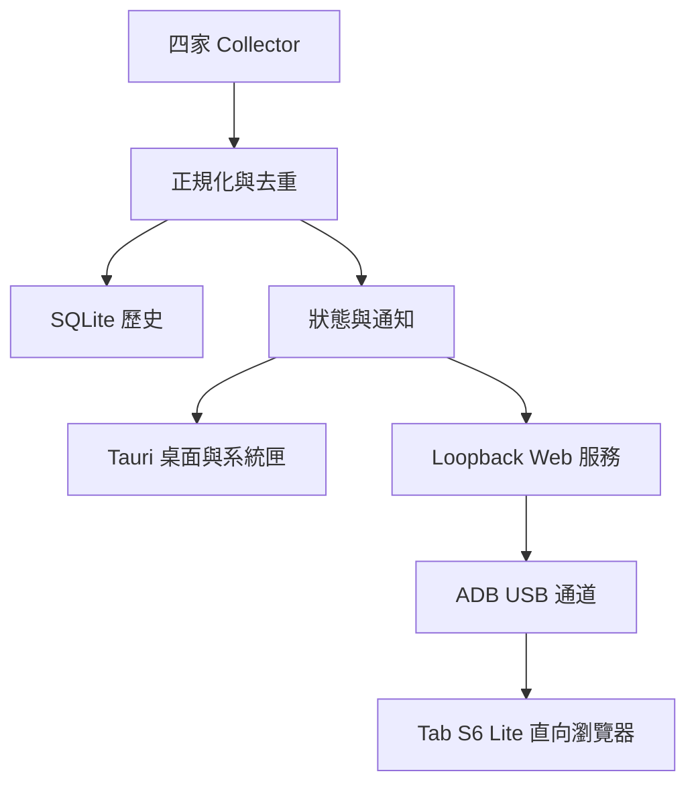

# AgentMeter｜AI Agent 用量監控中心

完整開發需求規格書 v1.1  
日期：2026-09-06  
文件用途：作為產品設計、技術驗證、程式實作與驗收的共同依據。  
狀態：grill-with-docs 後的需求基線；產品與架構決策已確認，但尚未完成四家帳號及 Tab S6 Lite 的 P0 實機驗證。

領域詞彙以 [`CONTEXT.md`](./CONTEXT.md) 為準；難以逆轉的決策與理由記錄於 [`docs/adr/`](./docs/adr/)；兩者與本文件衝突時應先停止實作並修正基線，不得自行選擇其中一份。

### v1.1 變更摘要

- 正式區分 Provider、Provider Account、Source、Quota Window、Data Quality 與 Collector Maturity；禁止在沒有穩定身分或使用者確認時跨 Source 合併帳號。
- 採分階段發布：技術預覽版可揭露受限來源，正式 v1 必須讓四家 Provider 都有至少一項可信、自動化且完成實帳驗證的資料來源。
- 依最新官方能力修正四家 Collector：Codex app-server、Claude statusLine、Copilot Billing API／preview SDK、Antigravity statusLine quota。
- 鎖定 Rust core＋Tauri 2 desktop shell＋Web frontend，v1 Collector 編譯進程式，不提供動態 plugin SDK。
- 將 Source 的 Availability、Collection State、Freshness、Failure Code 與 Collector Maturity 拆成正交維度。
- 定案 Dashboard Snapshot、SSE、非同步 refresh、ADB `--no-rebind`、兩層平板配對與 loopback HTTP 安全邊界。
- 定案本機隱私、資料清除、migration fail-closed、手動更新、正式版簽章及 zh-TW 範圍。
- 無法從本機安全判定的帳號方案、CLI 分布、Tab 型號與管理政策明確列入 P0，不作推測。

## 1. 產品目標

開發一套 Windows 桌面監控程式，集中顯示 Claude Code、Codex、GitHub Copilot、Google Antigravity 的用量、剩餘額度與重置時間。Windows 程式常駐系統匣；Samsung Galaxy Tab S6 Lite 透過 USB 連接，以直向瀏覽器儀表板顯示資訊。

產品核心價值是讓使用者快速知道「哪些 Provider 還能使用、何時重置、資料是否可信」。Token、Credits、請求數及限流百分比必須分開呈現，不建立沒有共同基礎的四家總剩餘量。產品面向單一 Windows 使用者，但可封裝供其他個人開發者安裝；不提供多人資料庫、Windows Service 或企業集中管理。

### 1.1 已確認與預設

| 項目 | 決策 | 性質 |
|---|---|---|
| 系統名稱 | AgentMeter／AI Agent 用量監控中心 | 沿用提案名稱，尚可更名 |
| 作業系統 | Windows 桌面 | 使用者確認 |
| 核心語言 | Rust | 使用者確認 |
| 常駐方式 | Windows 右下角系統匣 | 使用者確認 |
| 監控範圍 | Claude Code、Codex、Copilot、Antigravity | 使用者確認 |
| 平板 | Samsung Galaxy Tab S6 Lite，直放 | 使用者確認 |
| 平板連線 | USB 有線，Android ADB reverse | 本案主要實作路線 |
| 桌面介面 | Rust core＋Tauri 2＋TypeScript＋HTML/CSS | 使用者確認；非全 Rust GUI |
| 使用者模型 | 單一 Windows 使用者、單機本機資料 | 使用者確認 |
| 第一版帳號範圍 | 每個 Provider 同時顯示一個 active Provider Account；由官方工具切換登入，AgentMeter 只偵測、確認並隔離歷史 | 使用者確認 |
| Windows 版本 | 正式支援 Windows 11 x64；最低 build 於 P0 乾淨 VM 驗證後鎖定 | 目前實測基線 25H2 build 26200.9168 |
| UI 語言 | 正式交付 zh-TW；文案使用 resource keys | 英文翻譯延後 |
| WSL | 原生 Windows 優先；架構保留獨立 WSL Source | CLI 分布待 P0 確認 |

## 2. 範圍與交付界線

### 2.1 第一版必備

1. 四個 Provider 的獨立 Collector、能力檢查與成熟度標示。
2. Windows 系統匣、桌面儀表板、設定頁與診斷頁。
3. Source 可得的用量、剩餘額度、重置時間與模型維度。
4. 本機 SQLite History、Dashboard Snapshot、Usage Series、Quota Trend 及 Daily Summary。
5. USB 裝置辨識、授權狀態、連接埠轉送、開啟平板頁面及斷線復原。
6. 平板直向四卡片精簡畫面，點擊展開明細。
7. 低額度通知、資料過期提示、手動重新整理。
8. 安裝、升級、移除、診斷匯出與使用說明。

### 2.2 延後項目

區域網路遠端存取、多台電腦彙整、多帳號並列、iPad 專屬 USB 通道、遠端控制 Provider、自動切換模型、自動購買額度、雲端同步、手機原生 App、動態 Collector plugin SDK、第三方任意腳本 Collector、費率估算引擎、Windows 10、ARM64、Server 與 Wine 均不列入第一版。Windows 可辨識的實體第二螢幕仍可放置桌面儀表板；spacedesk 是替代顯示方式，不是必要依賴。

### 2.3 四個 Provider 的完成定義

採分階段發布。技術預覽版可包含 `experimental` 或 `unsupported` 的 Provider，但必須顯示具體阻礙、已驗證版本、替代方案與影響，且不得以空白卡片宣稱完成。正式 v1 發布前，四個 Provider 都必須至少有一項可信、自動化的 usage 或 quota 資料來源，並各自完成：一個真實帳號成功讀取、去識別化 fixture、欄位與 scope 說明、正常／缺欄位／超額／逾時／未登入／schema 變更測試、同時間官方畫面對照、支援版本與帳號類型說明，以及 fail-closed 驗證。缺少任一證據者只能標為 `experimental` 或 `unsupported`，不能進入正式 v1 的四家完成承諾。

## 3. 使用情境與主要流程

### UC-01 初次啟動

啟動精靈檢查 Provider CLI 路徑、版本、登入狀態與 ADB。使用者可指定執行檔與資料目錄；不直接要求輸入四家密碼，也不自動安裝 Provider CLI。各 Source 分別顯示 Availability、Collection State、Freshness、Failure Code 與 Collector Maturity。確認後開始監控。

### UC-02 平常工作

使用者照原本方式操作 Provider 工具。AgentMeter 蒐集可用資料，更新桌面與平板。關閉桌面視窗後縮回系統匣；使用者登出 Windows 或明確離開程式後停止監控。本案不需要 Windows Service。若使用者在官方工具切換帳號，AgentMeter 偵測 Provider Account 改變後要求確認 active account，且不代為登入或切換憑證。

### UC-03 USB 平板顯示

平板啟用 USB 偵錯並信任此電腦，接入支援資料傳輸的線材。App 列出 ADB 裝置，使用者首次選擇 Tab S6 Lite。App 啟動本機網頁服務、建立 reverse 映射，完成一次性配對後，在平板瀏覽器開啟直向儀表板。

### UC-04 恢復與异常

USB 拔除時平板在心跳逾時後標示斷線。重新插入已選定且已授權裝置時，App 重新驗證 mapping generation、重建 Tablet Session 與連線，正常情況不要求重新輸入配對碼。電腦休眠期間不更新；喚醒後先標示舊 Observation，再重新蒐集，不能將重置倒數歸零當成官方額度恢復。

### UC-05 暫停與恢復

使用者選擇暫停後，AgentMeter 停止 collection、重試與通知，但 tray、桌面與 Monitor-only Tablet Client 繼續顯示舊 Observation 並清楚標示 `paused`。Tablet refresh 回報 paused；只有明確按下恢復才重新收集，refresh 不得暗中解除暫停。

## 4. 資料定義與計算規則

| 指標 | 定義 | 顯示規則 |
|---|---|---|
| 輸入 Token | 來源定義的輸入 Token | 保留來源是否含快取的語意 |
| 輸出 Token | 模型產生的 Token | 與輸入分列 |
| 快取 Token | 讀取／建立快取用量 | 來源有區分才分列，避免重複相加 |
| 額度已用百分比 | 官方用量窗口消耗比例 | 必須標示所屬窗口 |
| 額度剩餘百分比 | 同一窗口的 100－已用百分比 | UI 衍生值限制在 0～100；原始超額完整保存 |
| Credits／請求數 | 服務定義的計費或用量單位 | 不強制換算 Token |
| 重置時間 | 來源回傳的窗口重置時刻 | UTC 儲存、依顯示時區呈現 |
| 上下文使用率 | 單一對話上下文占用 | 不當作帳號剩餘額度 |
| 費用 | Provider 直接回傳的官方費用 | v1 不自行以 Token、Credits 或請求數估價 |

- 缺值使用 null，UI 顯示「尚未取得」，不得以 0 或 100% 補值。
- 原始值、正規化值、來源時間與本機蒐集時間分開保存。
- 本機日誌只能代表讀到的範圍，不能宣稱涵蓋其他電腦或網頁使用。
- 限流窗口名稱依來源定義，不假定所有帳號一定有 5 小時與 7 天窗口。
- 每個 Observation 分開記錄 Data Quality（official、local_observed、estimated、manual）、Collector Maturity（stable、experimental、unsupported）與 Freshness；官方資料也可能來自實驗性 Collector 或已過期。
- 一張卡片有多個窗口時，精簡畫面顯示有效窗口中的最低剩餘比例，並清楚標示窗口；明細保留全部窗口。未知窗口不得參與最小值運算。
- Usage Series 只加總相同 Provider Account、scope、metric 與 unit 的可靠差量。Quota Trend 保存窗口快照的期末值、期間最低剩餘值及重置事件，快照絕不相加。
- Daily Summary 以使用者設定時區分桶，預設 Asia/Taipei，並保存 `bucket_timezone`。修改時區後，新彙總採新時區；raw event 尚存在的期間可選擇重建，無 raw event 的舊彙總保留原時區並明確標示。
- 累積計數器須辨識 session、重置及輪替後才計算差量，避免把每次快照的累積值重複加總。
- 同一 Provider Account 的共享 quota 以 Provider Account＋Provider bucket identity 去重；本機 usage event 保留 Source scope。只有穩定 Provider identity 或可撤銷的使用者 Account Link 才能跨 Source 合併，路徑、顯示名稱與「目前只有一個帳號」都不是合併證據。
- Over Limit 時主畫面顯示 0% remaining 並另標示超額比例；不能把超額解讀為額外付費或仍可使用。

## 5. 四家資料串接需求

下列依 2026-09-06 查閱的官方文件整理，屬實作起點；實際安裝版本、方案、權限及回傳結構仍須於 P0 以真實帳號再驗證。Collector 的官方性與成熟度是不同維度。

### 5.1 Claude Code：COL-CL

- 優先以官方 statusLine JSON 蒐集 session 用量及可用的 rate_limits。
- statusLine 是事件驅動來源，不是獨立帳號輪詢 API；Pro／Max 且 session 首次回應後才可能出現 rate_limits，窗口欄位可獨立缺失。
- rate_limits 可能包含 five_hour、seven_day 或其他窗口，依 Provider 回傳內容建模，不硬編固定窗口。
- AgentMeter 提供 PowerShell 接收器，只挑選必要統計欄位，原子寫入本機資料交接檔。
- 安裝接收器必須先取得使用者明確同意、預覽差異並備份設定；使用 wrapper 保留既有 statusLine 輸出。若無法可靠串接，維持原設定並顯示 `setup_required`，不直接覆蓋。
- 卸載時只移除 AgentMeter 自己加入且未被使用者修改的設定。
- 未啟動 Claude、尚未收到回應或沒有 quota 欄位，分別顯示原因；定時重跑顯示腳本不等於取得新的官方額度。
- 日誌歷史讀取只能作為 opt-in 補充；解析在記憶體中只抽取必要統計，使用版本化 parser 與訊息去重，不複製或保存提示詞、回應正文。

### 5.2 Codex：COL-CX

- 優先呼叫本機 codex app-server，以結構化協定查 `account/read`、`account/rateLimits/read` 與 `account/usage/read`；窗口依實際 `windowDurationMins` 建模。
- 實作 initialize／initialized、request id 配對、通知分流、逾時、程序退出與重新連線。
- 沿用 Codex 自己管理的登入流程，不複製驗證憑證到儀表板。
- 區分 ChatGPT 訂閱、API key 與其他認證模式；無訂閱 quota 不代表 API 額度無限。
- 只啟動查詢所需程序，不建立模型工作或消耗推論用量來探測。
- 不支援某方法時，降級到已驗證來源並標示能力差異，不無限重試。

### 5.3 GitHub Copilot：COL-GH

- P0 必須確認 Personal／Business／Enterprise、當前計費方式、帳務查詢權限與資料延遲。個人自購方案 REST endpoint 需要 user `Plan: read`；組織 endpoint 需要管理權限與 organization `Administration: read`。
- 現行資料以 AI Credits 為主，1 AI Credit 對應 USD 0.01 的計費單位；legacy premium requests 必須分開存放，不能混算。
- 優先使用符合帳號權限的官方 Billing API。Copilot SDK `account.getQuota` 可取得 entitlement、使用量、剩餘比例與 reset date，但 SDK 為 public preview，Collector 必須標為 `experimental`，直到實帳與版本相容證據足以升級。
- 已用費用、方案內含額度、額外付費預算、共用額度及個人限制分開建模；只取得消費值時不能自行推論剩餘額度。
- 尚無可用 API 時，允許匯入官方報表作為明確標示的延遲資料；報表匯入不能宣稱自動即時串接完成。
- 普通組織成員不得推論可讀取組織 pool；無權限時顯示 `permission_denied`。若需新增 token，採最小權限並存於 Windows 保護的憑證儲存，記錄 scope 及撤銷方式。

### 5.4 Google Antigravity：COL-AG

- 優先使用 Antigravity CLI statusLine JSON 的 `quota` map；各 bucket 可包含 `remaining_fraction`、`reset_time` 與 `reset_in_seconds`，屬結構化官方來源。
- `agy -p /usage` 是官方支援的 headless 呼叫，但輸出為文字報告而非穩定 JSON API，只能作為鎖定版本的 `experimental` fallback。
- P0 檢查使用者實際使用 IDE 或 CLI、版本、模型、帳號與合法可讀取的介面或本機資料。
- 選定來源後提供去識別化 fixture、欄位說明、更新時機與版本相容測試。
- statusLine 接收器比照 Claude：修改前需使用者同意、預覽差異、備份並保留既有輸出。文字解析須限制支援版本，解析失敗回傳 `schema_changed`，不能顯示舊數字為成功。
- 不繞過驗證、不掃描其他程序記憶體、不偽造請求；未確認可靠來源前不得承諾精確 Token 剩餘數。
- 各模型窗口分列，無法確認是否共享額度時不進行模型間合計。

### 5.5 目標支援矩陣

| Provider | Primary source | 正式目標 | Fallback／限制 |
|---|---|---|---|
| Claude Code | statusLine JSON | 實帳與版本矩陣通過後 `stable` | 事件驅動；日誌補充僅 opt-in，沒有 quota 欄位時保持 unknown |
| Codex | app-server 結構化協定 | `stable` | 方法不存在時只降級到經驗證來源，不以模型請求探測 |
| GitHub Copilot | 符合帳號權限的 Billing API | 個人帳號優先達 `stable` | preview SDK 為 `experimental`；組織資料需管理權限 |
| Google Antigravity | statusLine JSON quota map | 實帳與版本矩陣通過後 `stable` | headless `/usage` 文字解析只可為版本鎖定的 `experimental` fallback |

## 6. 桌面功能需求

| ID | 功能 | 必要行為 |
|---|---|---|
| DES-01 | 系統匣 | 啟用 Tauri `tray-icon`；左鍵依序 show、必要時 unminimize、focus；右鍵選單含儀表板、更新、USB、設定、暫停／恢復、離開；Windows 不依賴 tray title 顯示狀態 |
| DES-02 | 關閉行為 | 一般 `CloseRequested` 必須 prevent close 後 hide；首次提示一次；只有明確離開設定 terminating 狀態後才依序停止工作並結束程序 |
| DES-03 | 單一實例 | Tauri single-instance plugin 必須第一個註冊；第二次啟動只喚醒既有視窗，不得建立第二組 Collector、HTTP server、通知器或 ADB mapping |
| DES-04 | 自動啟動 | 預設關閉；由 Rust backend 管理 enable／disable／isEnabled；以 `--hidden` 啟動時不顯示主視窗但建立 tray 與必要服務 |
| DES-05 | 視窗位置 | 可置頂、記憶位置；螢幕消失時回可見範圍 |
| DES-06 | Source 設定 | 路徑、啟用狀態、官方登入入口、Availability、Collector Maturity、版本、active Provider Account 與可撤銷 Account Link |
| DES-07 | 重新整理 | 單 Provider 與全部排程；相同 Source 的短時間請求合併；Paused 時不暗中恢復 |
| DES-08 | 歷史 | 今日／7 日／30 日；只比較相同單位與資料範圍 |
| DES-09 | 診斷 | 顯示問題、重試及去識別化診斷 ZIP；建立前預覽 manifest 與遮罩摘要 |
| DES-10 | 資料生命週期 | 分開提供 Clear History、Forget Account、Clear Pairing、Reset AgentMeter；Reset 需二次確認，卸載預設保留資料 |

## 7. USB 與平板需求

### 7.1 前置條件

Windows 安裝可信 Android Platform Tools；Tab S6 Lite 啟用 USB 偵錯並由使用者授權；必要時安裝裝置驅動。線材需支援資料，不只充電。App 不自動代替平板信任電腦。技術預覽版不自動安裝 ADB；正式版只有在完成 Platform Tools 散布授權、簽章與更新策略審查後才能考慮隨包提供，否則只提供官方安裝指引。

### 7.2 連線管理：USB-01～USB-08

- USB-01：檢測 adb 路徑、版本、裝置序號、device／unauthorized／offline 狀態與 `transport_kind = usb | tcpip | emulator | unknown`；unknown／tcpip 不得當成 USB 成功。
- USB-02：儲存 selected serial；所有 reverse、list、remove、shell 指令都帶 `-s <serial>`，且每次操作前確認 state 為 device 並符合 USB-only policy。多裝置時禁止任意選第一台，`-d` 也不能取代序號。
- USB-03：Axum HTTP 只綁 `127.0.0.1:<host_port>`。tablet URL 使用獨立 `device_port`，預設 8317；host port 占用時可映射 `tcp:8317 -> tcp:<new_host_port>`，只有 device port 衝突才更換 tablet URL。
- USB-04：以參數陣列呼叫 `adb -s <serial> reverse --no-rebind tcp:<device_port> tcp:<host_port>`，避免 shell 字串拼接並以原子方式拒絕覆蓋既有 remote port。
- USB-05：以選定序號執行 `reverse --list` 作診斷。未知 mapping 衝突時顯示原因或選擇新 device port；退出或停用時只執行 `reverse --remove tcp:<owned_device_port>`，不呼叫 `kill-server`、`--remove-all` 或刪除其他工具的 mapping。
- USB-06：只有裝置 state、transport 與 reverse health 驗證通過後，才能用參數陣列執行 `am start -W -a android.intent.action.VIEW -d <url>`。結果只記為 `browser_launch_requested`，不視為頁面載入或 browser online；鎖定、chooser、無 handler 時提供人工指引。
- USB-07：USB 重插、adbd／ADB server 重啟與 Windows 喚醒後都重新驗證並按需重建 mapping；失敗採退避，不假定 mapping 持久，也不干擾其他 ADB 工具。
- USB-08：分別呈現 `usb_attached`、`adb_authorized`、`reverse_healthy`、`browser_session_online`；最後一項只能由已認證 HTTP／SSE heartbeat 決定。

### 7.3 配對與通訊

使用者先在桌面選定 ADB serial，桌面才顯示 8 位數一次性碼；有效 2 分鐘，每個 mapping generation 最多連續嘗試 5 次，超過後必須由桌面產生新碼。App 開啟不含秘密的 landing page，由使用者在平板輸入配對碼；成功後立即使代碼失效，設定 HttpOnly Device Pair cookie 與短效 Tablet Session。敏感值不進 log、URL 或長效 query string。

Device Pair 長期保留直到使用者撤銷、切換裝置或清除配對；Tablet Session 定期輪替，App 重啟、mapping generation 改變或帳號切換時失效，再以 Device Pair 自動換取新 session。所有 dashboard、history、SSE 與 refresh 路由都要求高熵 session；cookie 至少使用 HttpOnly 與 SameSite。Refresh 另需 CSRF 防護。Host／Origin 驗證及同源政策只作額外防護，不取代認證，也不使用寬鬆 CORS。

平板定義為 Monitor-only Tablet Client：允許查看、展開、切換主題及要求受節流的 refresh；禁止修改 Source、登入、清除資料、執行 shell、控制 Provider 或退出 AgentMeter。Web server 只在平板功能啟用時運行；停用、清除配對或離開時，先撤銷 session、關閉 SSE，再移除 owned mapping 並停止 listener。

通道採 loopback HTTP＋ADB reverse，不建立 LAN listener 或 Windows 防火牆入站規則，也不以 `adb -a` 啟動 server。此設計不宣稱端對端 TLS；Windows 本機程序與平板其他可開 socket 的 App 都屬威脅模型，必須靠 application session 認證保護資料。未來若要求傳輸機密性，需另導入 HTTPS 或原生 Android client。

### 7.4 直向視覺需求：TAB-01～TAB-07

- 頂部：AgentMeter、連線狀態與最後更新時間。
- 中段：Claude、Codex、Copilot、Antigravity 四張卡片依序直排；可設定順序。
- 卡片：名稱、資料狀態、大字剩餘額度、窗口／單位、重置倒數；次要列顯示已用量。
- 點擊卡片展開模型與窗口明細；精簡模式以四卡同屏為目標，字型放大時允許捲動。
- 底部：重新整理、主題、明細入口。觸控目標至少 44 CSS px；一般文字至少 16 CSS px，主數值建議 36～48 CSS px。
- 預設深色，支援亮色、文字標籤搭配色彩；不單靠紅綠辨識異常。
- 依實際瀏覽器 CSS viewport、縮放與系統字型驗收；不可只用面板實體像素寫死版面。直向為首要，旋轉橫向仍可使用。

瀏覽器全螢幕需使用者手勢，不能保證自動進入。保持亮屏是 best-effort；若瀏覽器或安全環境不支援，提供 Android「充電時保持喚醒」設定說明。USB 供電不保證長時間亮屏仍能補足耗電，需實機測試。

## 8. 更新、狀態與通知

本機事件來源優先採事件更新；可輪詢的官方來源預設 120 秒，依官方限制及來源特性調整，最短不得突破限流。手動刷新至少節流 10 秒。`POST /api/v1/refresh` 只接受排程並快速回傳 `202 Accepted`，列出 accepted 與 throttled Provider；實際結果由後續 Dashboard Snapshot 傳送。相同 Source 的重複請求合併。單次外部查詢預設逾時 15 秒；遵守 Retry-After，使用帶抖動退避，上限 15 分鐘。

`GET /api/v1/dashboard` 與 SSE `dashboard` event 都傳完整 Dashboard Snapshot：`schema_version`、App run 唯一的 `stream_id`、stream 內遞增 `revision`、`generated_at` 與四個 Provider view model。15 秒心跳不增加 revision，45 秒未收到即標示通道斷線；重連或 `stream_id` 改變時讀取完整快照，不跨 App 重啟比較 revision。前景恢復立即同步，不假定背景分頁計時器正常運作。

Source 狀態拆成正交欄位：Availability 為 `available | not_installed | setup_required | needs_login | unsupported | permission_denied`；Collection State 為 `idle | collecting | ready | backing_off | error`；Freshness 為 `unknown | fresh | stale`；Failure Code 可為 `rate_limited`、`schema_changed`、`timeout`、`process_exited` 等；Collector Maturity 為 `stable | experimental | unsupported`。一般輪詢 Source 超過 `max(3×週期, 5 分鐘)` 未成功即 stale；事件驅動 Source 依實際活動與 health 判斷，顯示「最後活動 Observation」，不得套用虛構輪詢週期。Freshness 與 USB 連線狀態也彼此獨立。

Paused 時停止所有新 collection、重試與通知，但保留 tray、桌面、tablet server 與既有 Observation。所有畫面標示 paused，Tablet refresh 回報 paused；只有明確 Resume 才重新收集。

低額度預設 20% 提醒、10% 警示，可調整。只對可比較且新鮮的 quota 觸發；同帳號／窗口／門檻只提醒一次，回升超過門檻 5 個百分點或新窗口才重新武裝。Windows 桌面通知受作業系統設定影響；App 內保留事件記錄。支援靜音，預設不發聲。剩餘量已知但沒有上限時顯示原單位，不套用百分比門檻。

## 9. 技術架構

架構正式鎖定 Rust core＋Tauri 2 desktop shell＋TypeScript Web frontend。Tokio、Axum、Serde、SQLite 為首選，只有 P0 spike 證明不合適才變更；具體套件版本在開發起始確認並鎖定 Cargo.lock 與前端 lockfile。平板共用純 Web 元件，不能依賴 Tauri 私有 API。



模組分為 core、collectors、storage、scheduler、usb、http、desktop、web-ui。Collector 介面提供 probe、collect、health、shutdown；回傳能力旗標而非固定假定 token／quota 都存在。四家 Collector 編譯進程式，需要時以明確 argv 的受控 subprocess 呼叫官方 CLI；v1 不載入第三方 binary、動態 library 或任意腳本 Collector。單一 Source 失敗不能阻塞其他 Source。

原生 Windows 與每個 WSL distribution 是不同 Source（environment、distribution、path、Provider Account identity）。WSL 接入必須另測命令引用、Windows／Linux 路徑、登入隔離及跨 Source 去重；沒有穩定 identity 或 Account Link 時不得合併。WSL 狀態目前因系統拒絕查詢而待 P0 確認，不自動當成現成支援。

## 10. 資料模型與本機 API

### 10.1 SQLite 邏輯資料表

| 表 | 主要欄位／要求 |
|---|---|
| provider_accounts | id、provider、stable_key_hash、display_label、identity_state、created_at、forgotten_at |
| account_links | id、provider_account_id、source_id、confirmed_at、revoked_at；只能由穩定 identity 或使用者確認建立 |
| provider_sources | id、provider、environment、distribution、path、active_account_id、enabled、capabilities、collector_maturity、parser_version |
| usage_events | id、source_id、provider_account_id、source_event_key、session_key、model、metric、value、unit、scope、observed_at、collected_at、data_quality；來源事件唯一鍵去重 |
| quota_snapshots | id、source_id、provider_account_id、provider_bucket_key、used、limit、raw_remaining、display_remaining、unit、used_percent、reset_at、observed_at、collected_at、data_quality、revision |
| daily_summaries | provider_account_id、scope、metric、unit、bucket_date、bucket_timezone、value、source_range、rebuildable_until |
| collector_health | source_id、availability、collection_state、freshness、failure_code、last_success、next_retry、schema_version |
| device_pairs | id、裝置識別雜湊、DPAPI 保護的 verifier、建立時間、最後使用、撤銷時間 |
| alert_events | provider_account_id、provider_bucket_key、threshold、window_key、notified_at；唯一鍵避免跨 Source 重複 |
| settings | key、value、schema_version；禁止存憑證明文 |

設定、資料與診斷放在使用者 LocalAppData/AgentMeter。v1 不導入 SQLCipher；資料依賴 Windows 使用者 ACL 與裝置磁碟保護，穩定 Provider identity 使用 keyed hash，Device Pair verifier 與其他秘密使用 DPAPI。預設快照保存 30 日、Daily Summary 180 日、診斷 7 日且限制總大小；預設每 5 分鐘或數值改變時寫 snapshot，避免輪詢造成無限制增長。時間用 UTC。

每次 DB migration 前建立帶 schema version 與時間的備份，最多保留最近 3 份。備份或 migration 失敗時 fail closed：不啟動 Collector、不寫入資料，提供診斷匯出與還原入口。

資料操作分離：Clear History 刪除 usage、quota、health history 與 alerts，但保留設定、Provider Account、Account Link 與 Device Pair；Forget Account 刪除指定 Provider Account、Account Link 及其 History；Clear Pairing 撤銷全部 Tablet Session 與 Device Pair；Reset AgentMeter 回復初始狀態並需二次確認。卸載預設保留 LocalAppData，另提供明確刪除選項。

### 10.2 平板 API 契約草案

| 路由 | 功能 | 限制 |
|---|---|---|
| GET /health | 服務存活 | 只回最少資訊 |
| POST /api/v1/pair | 交換一次性配對碼 | 8 位碼、2 分鐘、每 generation 5 次、防重播 |
| GET /api/v1/dashboard | 完整 Dashboard Snapshot | Tablet Session |
| GET /api/v1/events | 完整 Dashboard Snapshot SSE 與心跳 | Tablet Session、可撤銷 |
| GET /api/v1/history | 查詢指定 Provider／Account／Source 與期間 | Tablet Session、範圍及筆數上限 |
| POST /api/v1/refresh | 非同步排程刷新並回傳 202 | session 驗證、按 Source 節流與合併；Paused 時回報 paused |

範例為欄位契約示意，並非真實用量：

```json
{
  "schema_version": 1,
  "stream_id": "example-run-uuid",
  "revision": 42,
  "generated_at": "2026-09-06T01:00:01Z",
  "paused": false,
  "providers": [
    {
      "provider": "codex",
      "account_ref": "opaque-local-reference",
      "collector_maturity": "stable",
      "availability": "available",
      "collection_state": "ready",
      "freshness": "fresh",
      "failure_code": null,
      "data_quality": "official",
      "observed_at": "2026-09-06T01:00:00Z",
      "collected_at": "2026-09-06T01:00:01Z",
      "quota_windows": [
        {
          "bucket_key": "example-window",
          "label": "示範窗口",
          "unit": "percent",
          "used_percent": 35,
          "remaining_percent": 65,
          "reset_at": null
        }
      ],
      "tokens": null
    }
  ]
}
```

## 11. 安全、隱私與維運

1. 只收集用量統計，不保存原始對話、提示詞、回應正文、程式碼或專案正文。
2. 不提供預設遙測、自動 crash upload 或背景更新檢查。只有使用者按下「檢查更新」後才連線，下載與安裝仍需確認。
3. 本機資料可含使用模式與帳號識別；穩定 Provider ID 只保存 keyed hash。匯出時遮罩使用者名稱、路徑、裝置序號與任何 token。
4. 平板服務只聽 loopback；所有私人路由都需 session。Host／Origin 是額外防護而非身分。未來開 LAN 必須獨立實作 TLS、認證及權限。
5. 不讀取瀏覽器 cookie 資料庫、不繞過 Provider 驗證；來源變更應停用 parser、設 `schema_changed` 並提示。
6. 子程序以明確參數陣列與最小權限啟動，不從網頁接受任意命令。一般運作不需系統管理員權限。
7. 紀錄 Failure Code、時間與版本，不記錄 Authorization、cookie、配對碼、Device Pair verifier 或原始協定全文。
8. 診斷 ZIP 只包含版本、capability matrix、狀態轉換、Failure Code、schema／fixture 結果、資料筆數與時間範圍、已遮罩 ADB 狀態及 manifest；不含原始 SQLite、憑證、pair material、對話內容或完整個人路徑。匯出前顯示 manifest 與遮罩摘要。
9. ADB 只適合受控安全環境；受管理平板可能禁止 USB 偵錯，該情況列為環境阻礙，改用獲准方案，不繞過政策。
10. Windows 查詢 Provider 額度仍需網路；USB 只取代電腦與平板之間的傳輸網路。
11. 技術預覽版可未簽章但必須明示。正式 v1 的 executable、installer 與 uninstaller 必須 Authenticode 簽章，並發布 SBOM、依賴授權清單與 SHA-256；無有效簽章不得稱正式版。
12. Tauri installer 採 WebView2 `downloadBootstrapper` 小型線上安裝策略，明示首次安裝可能需連 Microsoft。不得使用 `skip`；離線 installer 列為後續額外交付。App 必須偵測 runtime 缺失並提供修復；Evergreen 更新需重啟才能由長時間常駐的 App 採用，不得在 active collection 或 DB transaction 中強制重啟。

## 12. 非功能需求與量測

以下為工程目標，P0 需記錄實際 Windows CPU／RAM、OS、WebView2、平板型號年份、Android 與瀏覽器版本後量測。

| ID | 目標 | 量測方式 |
|---|---|---|
| NFR-01 | UI 一般操作 300ms 內有回饋 | 排除官方查詢等待，仍須立即顯示 loading |
| NFR-02 | 啟動 5 秒內出現系統匣或啟動畫面 | 一般 SSD 驗收機，首次依賴安裝另計 |
| NFR-03 | 已收集資料 2 秒內送達在線平板 | 20 次 USB 更新至少 95% 達標 |
| NFR-04 | 閒置 5 分鐘平均 CPU <2% | 以驗收機總 CPU 計，外部工具程序另列 |
| NFR-05 | App＋WebView 工作集工程目標 <250MB | 非框架保證；分列 Rust process、WebView2 child processes、ADB／Provider subprocess，並揭露總量 |
| NFR-06 | 持續 8 小時不崩潰、無持續記憶體增長 | 啟動穩定後基準，含 USB 重插及來源失敗 |
| NFR-07 | 45 秒內顯示通道中斷 | 真正拔線測試，不只停前端假資料 |
| NFR-08 | USB 可用後 15 秒內完成映射與狀態復原 | 裝置已授權且未被鎖定／政策阻擋 |
| NFR-09 | 直向無水平捲動、主功能可觸控 | Tab S6 Lite 真機及 200% 字型放大 |

## 13. 驗收條件

| 編號 | 測試情境 | 通過條件 |
|---|---|---|
| AC-01 | 四 Provider 首次掃描 | 各自呈現 Availability、Collection State、Freshness、Failure Code 與 Collector Maturity，不互相阻塞 |
| AC-02 | 真實額度對照 | 四家各提供來源證據與同時間 UI 對照；只允許文件化的四捨五入及來源延遲 |
| AC-03 | null 或缺失窗口 | 顯示未知，不顯示 100% 剩餘 |
| AC-04 | Token 與 quota 不同範圍 | 清楚標示 session／本機／帳號，不誤加總 |
| AC-05 | 日誌重讀與程序重啟 | 相同事件只計一次，累積快照不重複加總 |
| AC-06 | 額度到期但查詢失敗 | 顯示待確認，不自行恢復額度 |
| AC-07 | 429／逾時／schema 改變 | 正確分類、退避、保留帶時間的舊快照 |
| AC-08 | 關閉視窗與再次啟動 | hide 後 process、Collector、tray、必要 server 均存活；正常、minimized、hidden 與 autostart/manual race 都只喚醒同一實例，tray Exit 才完整 shutdown |
| AC-09 | USB 首次接線未授權 | 指引平板授權，不出現假成功 |
| AC-10 | 多台 Android 同時連接 | 兩台實體裝置加 emulator／TCP device 混合時，只以 `-s` 操作使用者選定的 USB transport，不任選第一台 |
| AC-11 | USB 拔插與 mapping 競爭 | 斷線標示及自動復原符合 NFR；`--no-rebind` 拒絕未知 mapping race，只移除 owned mapping |
| AC-12 | 平板直向四卡 | 大字可讀、卡片展開正常、資料單位完整 |
| AC-13 | 通道在線但來源過期 | 同時顯示已連線與來源過期，不混淆 |
| AC-14 | 低額度通知 | 跨門檻一次通知，重複刷新不重複通知 |
| AC-15 | 未配對與惡意 client | Windows 本機未授權 process、平板另一 App／browser profile、惡意 Host／Origin、缺少／錯誤 CSRF、重播 pair code、舊 generation session 都無法取得資料或 refresh；health 不洩漏帳號、usage 或 serial |
| AC-16 | 升級、migration 與卸載 | migration 前備份且失敗時 Collector／DB write 不啟動；可還原；卸載預設保留資料並可明確刪除；既有 statusLine 設定不受破壞 |
| AC-17 | 睡眠、喚醒、斷網 | 顯示停更並恢復排程，不製造錯誤用量 |
| AC-18 | 帳號切換與身分未知 | 新舊 Provider Account 額度及 History 隔離；沒有穩定 identity 時不跨 Source 合併；Account Link 可建立與撤銷 |
| AC-19 | 埠占用、ADB 缺失 | 有可執行修復指引，無崩潰或覆蓋未知映射 |
| AC-20 | 8 小時真機運行 | 提交效能紀錄與斷線復原證據 |
| AC-21 | 正交 Source 狀態 | 可同時表示 rate-limited＋stale、available＋backing_off 等組合，不因單一 enum 遺失資訊 |
| AC-22 | SSE 重連與 App 重啟 | 同 stream revision 單調遞增；heartbeat 不遞增；漏事件、前景恢復或新 stream 都以完整 Dashboard Snapshot 收斂 |
| AC-23 | 非同步 refresh 與 Paused | refresh 快速回傳 202、合併重複 Source 並由 SSE 回結果；Paused 時不執行也不暗中恢復 |
| AC-24 | 配對防重播 | 8 位碼 2 分鐘失效、成功後不可重用、5 次失敗後必須重發；URL、log 與診斷無 pair material |
| AC-25 | Loopback 邊界 | listener 只在平板功能啟用時綁 127.0.0.1，無 0.0.0.0／LAN listener 或防火牆規則；同 LAN 主機負向測試通過 |
| AC-26 | 資料清除操作 | Clear History、Forget Account、Clear Pairing、Reset AgentMeter 各只影響定義範圍，Reset 二次確認 |
| AC-27 | statusLine 共存 | Claude／Antigravity 修改前有同意、差異與備份；wrapper 保留既有輸出；卸載只移除未被使用者改動的 AgentMeter 部分 |
| AC-28 | WebView2 安裝 | 乾淨 Windows 缺 runtime 時由 downloadBootstrapper 成功安裝；舊 runtime、更新後重啟與失敗修復指引通過 |
| AC-29 | 正式版供應鏈 | executable、installer、uninstaller Authenticode 有效，SHA-256、SBOM 與授權清單可取得；未簽章只允許技術預覽版 |
| AC-30 | 診斷匯出 | 使用者先看到 manifest；ZIP 已遮罩，且不含 raw DB、credential、pair material、對話內容或完整個人路徑 |

測試包括 parser fixture、正規化／去重單元測試、API 認證整合測試、Tauri window lifecycle、ADB argv／mapping 替身與真機驗收。模擬資料只能驗證 UI，不能取代四家真實來源驗收。每個 Collector 至少包含正常、缺欄位、超額、版本變更、逾時、未登入與 schema 變更案例。

## 14. 開發階段與交付物

| 階段 | 工作 | 出口條件／依賴 |
|---|---|---|
| P0 可行性驗證 | 確認 OS、Provider 環境與帳號；四 Collector spike；Tab USB 簡單頁；乾淨 VM/WebView2 | 每家完整證據包、去識別化 fixture、支援矩陣、真機 USB 與安全負向測試；未知條件不得猜測 |
| P1 核心骨架 | Rust/Tauri 模組、SQLite migration、正交狀態模型、單一實例、tray | Mock Collector 可跑完整流程，清楚標示模擬；migration fail-closed 測試通過 |
| P2 真實來源 | 四內建 Collector、官方登入指引、identity、Account Link、去重與降級 | AC-01～07、18、21、27；不得以 mock 宣稱完成 |
| P3 平板顯示 | loopback API、Device Pair、Tablet Session、Dashboard Snapshot、SSE、ADB、直向 UI | AC-09～13、15、19、22～25，Tab S6 Lite 真機驗證 |
| P4 產品化 | 設定、通知、History、診斷、資料清除、線上安裝包、升級與卸載 | AC-08、14、16、17、26、28、30 |
| P5 發布驗收 | 簽章、安全、效能、8 小時運行、四家來源比對 | AC 全部對照；四家皆達正式完成證據且 AC-29 通過後才發布正式 v1 |

P0 通過前不承諾四家的精確讀取能力、Collector Maturity 或固定工期。技術預覽版可先交付能力矩陣；P1 可使用 fixture 建立骨架，但正式 Provider 支援由 P0 證據決定。UI 與 USB 共用 Dashboard Snapshot 契約後可獨立實作，不強制特定多代理工作方式。

必要交付：完整原始碼、Cargo.lock 與前端 lockfile、建置說明、Windows 安裝包、簽章與 SHA-256、SBOM、第三方依賴授權清單、資料模型與 API 文件、四家 Provider 相容矩陣、去識別化 fixture、測試報告、USB 初次設定說明、診斷匯出說明、常見問題與已知限制。

## 15. 風險與待確認

| 項目 | 影響 | 處理策略 |
|---|---|---|
| Provider CLI 位於 WSL | 原生路徑與登入不同 | 每個 distribution 視為獨立 Source；P0 確認後才加入 bridge |
| Copilot 帳號權限 | 個人不一定能用組織 API | 先驗證可讀範圍，再訂 quota 算法 |
| Antigravity 版本差異 | statusLine quota 與 headless 文字格式可能依版本改變 | statusLine 優先；P0 鎖版本與 fixture，文字 fallback 保持 experimental |
| Claude statusLine 既有設定 | 可能破壞使用者工作流 | 備份、串接與安全還原 |
| 官方欄位變動 | 錯誤數值比無資料更危險 | 版本化、fixture、fail closed |
| Tab S6 Lite 不同年份／OS | USB 驅動與瀏覽器行為不同 | 確認實機版本，不假定全部相同 |
| 院內 USB／網路政策 | ADB 或官方請求可能被限制 | 使用獲准方案，不繞過管理措施 |
| 瀏覽器背景節流／螢幕關閉 | 顯示停止更新 | 恢復前景重同步、亮屏降級指引 |
| 未簽章技術預覽版 | SmartScreen 與發布身分不足 | 明示 preview；正式 v1 必須 Authenticode |
| Loopback HTTP 非端對端 TLS | 本機或平板惡意 App 可能嘗試存取 | 全路由 session 認證、pair 防重播、Host／Origin 防禦；不宣稱傳輸加密 |
| Daily Summary 跨時區 | raw event 過期後無法完整重算 | 保存 bucket_timezone；只重建仍有 raw event 的期間 |

### 15.1 已確認的本機事實

- Windows 11 x64，25H2，build 26200.9168；這是第一個實測基線，不代表已涵蓋所有 Windows 11。
- Codex CLI `0.151.0-alpha.7.1` 可用。
- Rust `1.95.0`、Cargo `1.95.0`、Node `24.12.0`、npm `11.6.2` 可用。
- Claude CLI、GitHub CLI 與 ADB 目前不在可發現路徑中。
- WSL command 存在，但狀態查詢遭系統拒絕，distribution 與 Provider 安裝情況未知。
- WebView2 Runtime 已安裝；仍需乾淨 VM 驗證 bootstrapper 路線。

### 15.2 待 P0 驗證，不得推測

- Claude 方案及主要運行於 Windows 或 WSL。
- Codex 使用 ChatGPT 訂閱、API key 或其他認證模式，以及實際方案。
- Copilot 為 Personal、Business 或 Enterprise；若屬組織帳號，使用者是否具有管理權限。
- Antigravity 使用 IDE 或 CLI、帳號方案、實際版本與 statusLine quota 可用性。
- Tab S6 Lite 型號代碼、年份、Android 版本、Chrome／Samsung Internet 版本與背景 SSE/cookie 行為。
- 電腦或平板是否受公司／院內政策管理，限制 USB debugging、CLI 安裝、外部網路或驅動程式。

上述未知不阻擋 v1.1 需求基線成立，但會阻擋對應 Collector、USB、安全與效能項目的 P0 通過。

## 16. 官方參考資料與證據邊界

以下是本次討論已查閱的官方文件，查核日期為 2026-09-06；版本與服務政策可能變更，開發起始應再次核對。文件支持介面存在或使用方式，不代表本案已實作成功。

1. Claude Code statusLine：<https://code.claude.com/docs/en/statusline>。用於理解 JSON 欄位、可缺失的限流窗口與設定方式。
2. Codex App Server：<https://github.com/openai/codex/blob/main/codex-rs/app-server/README.md>。用於 `account/read`、`account/rateLimits/read`、`account/usage/read` 與協定生命週期。
3. GitHub 個人用量計費：<https://docs.github.com/copilot/concepts/billing/usage-based-billing-for-individuals>。
4. GitHub Billing usage API：<https://docs.github.com/en/rest/billing/usage>。需依帳號和權限核對，不能推論所有人都可查同一端點。
5. GitHub Copilot SDK usage and billing：<https://docs.github.com/en/copilot/how-tos/copilot-sdk/features/usage-and-billing>。`account.getQuota` 屬 public preview，不能等同 stable。
6. GitHub Copilot billing units：<https://docs.github.com/en/billing/concepts/product-billing/github-copilot-billing>。用於 AI Credits 與 legacy premium requests 邊界。
7. Antigravity statusLine：<https://antigravity.google/docs/cli/statusline/>。確認結構化 `quota` map。
8. Antigravity headless mode：<https://antigravity.google/docs/cli/headless/>；`/usage`：<https://antigravity.google/docs/cli/commands/usage>。確認可 headless 呼叫但輸出非穩定 JSON API。
9. Android ADB：<https://developer.android.com/tools/adb>；AOSP adb man page：<https://android.googlesource.com/platform/packages/modules/adb/+/refs/heads/main/docs/user/adb.1.md>。用於 `-s`、reverse、`--no-rebind` 與精確移除。
10. Android 本機服務存取：<https://developer.android.com/develop/ui/views/layout/webapps/access-local-server>。用於實體 USB 裝置的 ADB reverse 與 localhost 行為。
11. Android URL intents：<https://developer.android.com/guide/components/intents-common#Browser>。用於 browser launch 證據邊界。
12. Tauri 2 system tray：<https://v2.tauri.app/learn/system-tray/>；single instance：<https://v2.tauri.app/plugin/single-instance/>；autostart：<https://v2.tauri.app/plugin/autostart/>。
13. Tauri Windows installer／WebView2：<https://v2.tauri.app/distribute/windows-installer/>；Microsoft WebView2 distribution：<https://learn.microsoft.com/en-us/microsoft-edge/webview2/concepts/distribution>。
14. spacedesk Android USB 替代方案：<https://manual.spacedesk.net/AndroidUSBCableConnection.html>。

## 17. 提供給開發者的啟動指令

> 請依 AgentMeter v1.1 規格開發 Windows 11 x64 的 Rust core＋Tauri 2 桌面程式。先執行 P0，為四個 Provider 建立真實帳號證據包，並在指定 Tab S6 Lite 驗證 ADB reverse、配對、SSE 與安全負向案例，再建立核心架構。所有未知 Observation 使用 null；Data Quality、Collector Maturity、Availability、Collection State、Freshness、Failure Code 與 Source scope 分開呈現。不得以 fixture 冒充真實串接、不得自動合併不明帳號、不得覆蓋既有 statusLine，也只清理由 AgentMeter 建立的 mapping。每個階段交付可重現操作、測試證據與已知限制；以第 13 節驗收條件及 P0 證據門檻作為完成依據。
